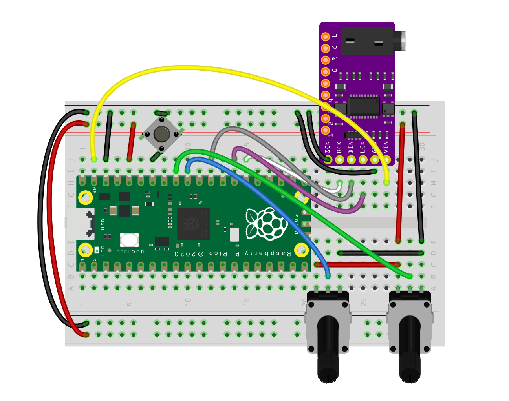

# [Synthio Tutorial](..): Getting Started

<!--ts-->
* [Synthio Tutorial: Getting Started](#synthio-tutorial-getting-started)
   * [Wiring up](#wiring-up)
      * [With a breadboard](#with-a-breadboard)
      * [Using the pico_test_synth PCB](#using-the-pico_test_synth-pcb)
   * [Code setup](#code-setup)
* [Make a Sound](#make-a-sound)
   * [Hello boop!](#hello-boop)
   * [Simple test, with buffer and organized](#simple-test-with-buffer-and-organized)
   * [Fun with boops](#fun-with-boops)
      * [Generative tunes on a pentatonic scale](#generative-tunes-on-a-pentatonic-scale)
      * [Play a chord melody](#play-a-chord-melody)
   * [Controlling Notes](#controlling-notes)
      * [Controlling with buttons](#controlling-with-buttons)
      * [Controlling with MIDI](#controlling-with-midi)

<!-- Created by https://github.com/ekalinin/github-markdown-toc -->
<!-- Added by: tod, at: Wed Mar 12 09:29:37 PDT 2025 -->

<!--te-->


## Wiring up

The examples in this tutorial will use the following components:

- 1 x Raspberry Pi Pico RP2040 or compatible (e.g. [PicoH](https://www.sparkfun.com/raspberry-pi-pico-h.html), Pico and solder your own   2[headers](https://amzn.to/3DG589t))
- 1 x PCM5102 I2S DAC module or similar ([example](https://amzn.to/4bPbHD3), [adafruit](https://www.adafruit.com/product/6251))
- 2 x 10k potentiometers ([example](https://amzn.to/43J0fa5), 5k or 20k will also work)
- 1+ x tact switch buttons ([breadboard-friendly versions](https://amzn.to/43J0fa5))

But these examples will work with just about any board/chip that has
CircuitPython `synthio` support and some sort of audio output,
like a [QTPy RP2040 with PWM output](https://github.com/todbot/qtpy_synth).

You will also need either headphones or a powered speaker to hear the synth.


### With a breadboard

A quick way of assembling the above components is with a solderless breadboard.
And even though the wiring up connections *between* modules is solderless,
you still need to solder header pins to the Pico module and PCM5102 module.
This [soldering is pretty quick](https://www.youtube.com/watch?v=YhdrowzzEjo)
and if you've not done it before, it's a good way to learn soldering.

Breadboarding circuits is a great way to get started, but breadboard connections can become
intermittent, making them frustrating.




### Using the pico_test_synth PCB

[ image of pico_test_synth ]

## Code setup

- [Install CircuitPython for Pico](https://learn.adafruit.com/getting-started-with-raspberry-pi-pico-circuitpython/circuitpython)
as normal.

- Considering [installing circup](https://learn.adafruit.com/keep-your-circuitpython-libraries-on-devices-up-to-date-with-circup/install-circup) to make adding libraries easier

- Use your editor of choice to edit the .py files on the device's CIRCUITPY drive


# Make a Sound

## Hello boop!

Let's test out the wiring.  Create a `code.py` file
on the CIRCUITPY drive with the contents of the
[`code_helloboop.py`](./1_getting_started/code_helloboop.py) shown below.

This example makes a beep with random pitches every 0.5 seconds.
It uses the square-wave waveform that's built-in to `synthio`.

```py
# 1_getting_started/code_helloboop.py
import time
import random
import board
import synthio
import audiobusio

# how we have our circuit wired up or pico_test_synth
i2s_bck_pin = board.GP20
i2s_lck_pin = board.GP21
i2s_dat_pin = board.GP22

# hook up external stereo I2S audio DAC board
audio = audiobusio.I2SOut(bit_clock=i2s_bck_pin, word_select=i2s_lck_pin, data=i2s_dat_pin)
# make the synthesizer
synth = synthio.Synthesizer(sample_rate=44100, channel_count=2)
# plug synthesizer into audio output
audio.play(synth)

midi_note = 60  # midi note to play, 60 = C4

while True:
    print("boop!")
    synth.press(midi_note) # start note playing
    time.sleep(0.1)
    synth.release(midi_note) # release the note we pressed
    time.sleep(0.4)
    midi_note = random.randint(32,72)   # pick a new random note
```
> [1_getting_started/code_helloboop.py](./1_getting_started/code_helloboop.py)

Note that in the above code:
- The I2S DAC requires three pins. On the Pico RP2040, the "bit_clock"
and "word_select" pins must be adjacent.
- The `Synthesizer` requires a sample_rate (44,100 is "CD-quality") and a
"channel_count". I2S is stereo, so channel_count=2.
- You "plug" the synth into the audio output to allow the synth to be heard.
- To start a sound, use `synth.press()`.
This takes either a MIDI note number from 0-127 or a `synthio.Note()`.

This sounds like:


```
[ ... TBD video of code_helloboop.py TBD ... ]
```

## Simple test, with buffer and organized

There is an issue with the above code however.
With the synth plugged directly into the audio output, there's very little buffer
for the CPU to compute samples. It's also hard to change the overall volume of
the synth. The solution to both issues is to plug an [`audiomixer`](https://docs.circuitpython.org/en/latest/shared-bindings/audiomixer/index.html)
in between.

This means the audio setup goes from this:

```py
audio = audiobusio.I2SOut(bit_clock=i2s_bck_pin, word_select=i2s_lck_pin, data=i2s_dat_pin)
synth = synthio.Synthesizer(sample_rate=44100, channel_count=2)
audio.play(synth)  # plug synth directly into audio output
```
to this:

```py
audio = audiobusio.I2SOut(bit_clock=i2s_bck_pin, word_select=i2s_lck_pin, data=i2s_dat_pin)
mixer = audiomixer.Mixer(sample_rate=SAMPLE_RATE, channel_count=2, buffer_size=BUFFER_SIZE)
synth = synthio.Synthesizer(sample_rate=SAMPLE_RATE, channel_count=2)
audio.play(mixer)  # plug mixer into the audio output
mixer.voice[0].play(synth)  # plug synth into mixer's first 'voice'
```

Also, to make it easier to see what's different each time,
let's pull out all that setup and [put it into a new file called
`synth_setup.py`](./1_getting_started/synth_setup.py).

Our [`code.py`](./1_getting_started/code_synth_setup.py) now looks like the below.
We'll use this technique going forward.

```py
# 1_getting_started/code_synth_setup.py
import time, random
# run the setup and get a synth
from synth_setup import synth

midi_note = 60  # midi note to play, 60 = C4

while True:
    print("boop!")
    synth.press(midi_note) # start note playing
    time.sleep(0.2)
    synth.release(midi_note) # release the note we pressed, notice it keeps sounding
    time.sleep(0.5)
    midi_note = random.randint(32,72)   # pick a new random note
```
> [1_getting_started/code_synth_setup.py](./1_getting_started/code_synth_setup.py)

And this sounds like:

```
[ ... TBD video of code_synth_setup.py TBD ... ]
```


The sleep times have been sped up, so you can hear the notes overlapping more.
Also note there's been a special change at the end of `synth_setup.py` to make
the boops more appealing. More on that later.

## Fun with boops

With just the above, we can do some fun.

### Generative tunes on a pentatonic scale

This example uses a list of note offsets in a pentatonic scale.
Inside the `while`-loop, a random note is created from that list and played.
Since the note keeps sounding after the `synth.release()`, there are some overlap
of the notes, giving us hints of chords.  And since this is a pentatonic scale,
just about any combination of two notes sounds good together.

```py
# 1_getting_started/code_generative_penta.py
import time, random
from synth_setup import synth
root_note = 48
scale_pentatonic = (0, 2, 4, 7, 9, 12, 14, 16, 19, 21)  # two octaves of offsets

while True:
    midi_note = random.choice( [root_note+x for x in scale_pentatonic] )
    print("playing!", midi_note)
    synth.press(midi_note)
    time.sleep(0.1)
    synth.release(midi_note) # release the note we pressed, notice it keeps sounding
    time.sleep(0.2)
```
> [1_getting_started/code_generative_penta.py](./1_getting_started/code_generative_penta.py)

```
[ ... TBD video of code_synth_setup.py TBD ... ]
```

### Play a chord melody

A similar technique lets us play a melody with chords.
In this case, we have a list of notes for our melody
(the timing between notes is still fixed)
and a list of offsets for the block chord to play based on a note.

```py
# 1_getting_started/code_chord_melody.py
import time, random
from synth_setup import synth

melody_midi_notes = (50, 55, 57, 59, 59, 59, 57, 59, 55, 55)
chord = [0,4,7]

while True:
    midi_note = melody_midi_notes[i]
    i = (i+1) % len(melody_midi_notes)
    print("playing!", midi_note)
    for n in chord: synth.press(midi_note + n)
    time.sleep(0.1)
    for n in chord: synth.release(midi_note + n)
    time.sleep(0.1)
```
> [1_getting_started/code_chord_melody.py](./1_getting_started/code_chord_melody.py)

[ ... TBD video of code_synth_chord_melody.py TBD ... ]

## Controlling Notes

So far, the code has been triggering notes by itself.  But it's pretty easy to trigger
with keypresses or MIDI.

### Controlling with buttons

Here's an example with physical buttons.
The `pico_test_synth` PCB has only one physical button, but with a breadboard,
you can wire up more.

The `synth_setup.py` file has been updated to have a list of button pins
and the creation of a [`keypad`](https://docs.circuitpython.org/en/latest/shared-bindings/keypad/)
"keys" object that does button debouncing and press/release events.

```py
# 1_getting_started/code_buttons.py
import synthio
from synth_setup import synth, keys
root_note = 48  # the lowest note to play

while True:
    if key := keys.events.get():
        midi_note = root_note + key.key_number  # different note for each key
        if key.pressed:
            synth.press(midi_note)
        if key.released:
            synth.release(midi_note)
```
> [1_getting_started/code_buttons.py](./1_getting_started/code_buttons.py)

```
[ ... TBD video of code_buttons.py TBD ... ]
```


### Controlling with MIDI

MIDI control is very similar, since it also has key press/release events called
"noteOn"/"noteOff".  Since USB MIDI is easier to set up (no extra circuitry needed),
it's shown here, but standard 5-pin MIDI over a UART works too.

Instead of using `adafruit_midi`, the [`tmidi`](https://github.com/todbot/CircuitPython_TMIDI) library
is shown here (available via `circup` and in the [CircuitPython Community Bundle](https://github.com/adafruit/CircuitPython_Community_Bundle/)).

More details on handling MIDI is in [README-5-MIDI.md](README-5-MIDI.md)
```py
# 1_getting_started/code_midi.py
import usb_midi, tmidi
from synth_setup import synth

midi_usb = tmidi.MIDI(midi_in=usb_midi.ports[0], midi_out=usb_midi.ports[1])

while True:
    if msg := midi_usb.receive():
        print("midi:", msg)
        # noteOn must have velocity > 0
        if msg.type == tmidi.NOTE_ON and msg.velocity != 0:
            synth.press(msg.note)
        # some synths do noteOff as noteOn w/ zero velocity
        elif msg.type in (tmidi.NOTE_OFF, tmidi.NOTE_ON) and msg.velocity == 0:
            synth.release(msg.note)
```
> [1_getting_started/code_midi.py](./1_getting_started/code_midi.py)


```
[ ... TBD video of code_synth_midi.py TBD ... ]
```
